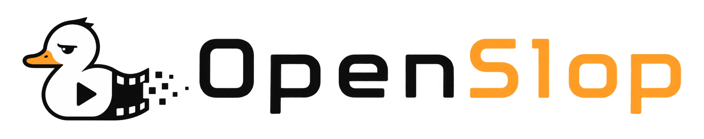

<p align="center">
  <a href="https://bun.sh"></a>
  <a href="https://www.typescriptlang.org/"></a>
  <a href="https://fastify.dev/"></a>
  <a href="https://mastra.ai"></a>
  <a href="./LICENSE"></a>
  <a href="https://github.com/anomalyco/openslop/issues"></a>
</p>

<h3 align="center">Persona → Ideas → Scripts → Video. Ship TikToks, Reels & UGC in minutes.</h3>

<p align="center">
  <strong>OpenSlop</strong> is an open-source content engine for <strong>small teams making TikTok & Instagram videos</strong> — talking-head, UGC, and product demos. Add your own influencer or spin up a custom AI one. Your brand persona drives everything. Pick a type, pick a duration, generate, render.
</p>

<p align="center">
  <sub>Topics: <code>ai video generation</code> · <code>runwayml</code> · <code>veo</code> · <code>luma dream machine</code> · <code>ugc</code> · <code>talking head</code> · <code>greenscreen</code> · <code>mastra</code> · <code>fastify</code> · <code>better-auth</code> · <code>tiktok</code> · <code>instagram reels</code></sub>
</p>

---

## Why OpenSlop?

- **Built for small teams, not enterprises.** No agency workflow. One dialog: `type → duration → ideas → generate → render`.
- **Persona-driven.** Add a brand (`website` → Mastra scrapes → LLM persona: audience, voice, pain points, positioning). Ideas and scripts never leave that voice.
- **Custom or owned influencers.** `talkinghead` for presenter, `greenscreen` for overlay/AI actor, `carousel` for multi-slide social. Bring your face or generate one.
- **Duration-aware video.** `15s` (3 clips) · `30s` (6) · `45s` (9) — default `15`. Hidden for `carousel`. Each clip is `5s`, chained **frame-to-frame**: first clip `text_to_video`, rest `image_to_video` with the previous clip's last frame (PNG via `ffmpeg`). Cheap — one image, not an expensive `referenceVideo`.
- **Provider routing done right.** Text ideas/scripts always use your LLM provider (`openai|anthropic|google|xai|openrouter|ollama|custom`). Video render uses your media provider (`runway` `gen4.5`/`veo3.1`/`seedance2`, `luma` `ray-2`, `vertex` `veo`). Mix and match per task in **Settings → AI Providers**.
- **Local by default.** SQLite + `data/media/` cache, served at `GET /media/files/:filename`. No S3 bill to start. Vite proxies `/companies`, `/contents`, `/media`, `/ai`.

---

## Tech Stack

| Layer | What |
|---|---|
| **Backend** | `Fastify 5` · `better-auth 1.7` · `Drizzle ORM (sqlite)` · `Mastra 1.62` workflows + `AI SDK` · `Zod` |
| **Frontend** | `Vite 8` · `React 19` · `shadcn` · `Tailwind 4` · `Geist` · `React Router 7` |
| **Media** | `Runway` `POST /v1/text_to_video` → `image_to_video` (`ratio 1280:720`/`720:1280`, `duration:5` locked) · `Luma` · `Vertex Veo` · `ffmpeg` concat/last-frame |
| **Ops** | `Bun` · `drizzle-kit` · `Vite proxy` |

**Architecture**

```
Browser :5173 (Vite)
  │  proxies /companies /contents /media /ai /health → :3000
  ▼
Fastify :3000  ── better-auth (session)
  ├─ Mastra: companyPersonaWorkflow (fetch→generate→persist)
  ├─ Content: ideas (LLM) → scripts → contents row {scripts, format, duration}
  └─ Media: video.workflow fetch → chunkedRender (N = duration/5)
       ├─ text_to_video (chunk 0) → poll GET /v1/tasks/:id
       ├─ image_to_video (chunks 1..N-1, promptImage = last frame data URI)
       ├─ download → data/media/<id>_part*.mp4 → ffmpeg last frame → ffmpeg concat → final.mp4
       └─ contents.mediaUrl = /media/files/<final>.mp4
SQLite (ai_config, ai_preferences, companies, contents, media_jobs)
```

---

## Getting Started

**Prereqs:** `Bun 1.x` + `Node 18+` + `ffmpeg` (`ffmpeg -version`) + `openssl`.

```bash
git clone https://github.com/anomalyco/openslop.git openslop
cd openslop

# 1. env — 32+ char secret required
cp backend/.env.example backend/.env
# edit backend/.env and set:
#   BETTER_AUTH_SECRET=$(openssl rand -base64 32)
#   BETTER_AUTH_URL=http://localhost:3000
#   PORT=3000  HOST=0.0.0.0

# 2. install (root runs both)
bun install
# or: npm install && npm install --prefix backend --prefix frontend

# 3. run — two terminals or one:
bun --cwd backend run dev   # Fastify :3000 — swagger at http://localhost:3000/docs
bun --cwd frontend run dev  # Vite :5173 — app at http://localhost:5173
# one-liner from repo root:
npm run dev
```

* Existing DBs auto-migrate `contents.duration` on first `GET /companies/:id/contents` / render — no manual `ALTER TABLE` needed. Optional: `bunx --cwd backend drizzle-kit generate`.
* `ffmpeg` is required for chunked stitching. `brew install ffmpeg` (macOS) / `sudo apt install ffmpeg` (Ubuntu).

---

## Configure AI Providers

Open **Settings → AI Providers** after signing up. Providers are **per-user** (`ai_config`) and routed per-task (`ai_preferences`).

| Task | Must be | Providers | Notes |
|---|---|---|---|
| **Text** (ideas, scripts, persona) | LLM | `openai` `anthropic` `google` `xai` `openrouter` `ollama` `custom` | Ideas/scripts **always** `text` — `kind` only hints the prompt |
| **Video** (render) | Media | `runway` (`gen4.5`, `veo3.1`, `veo3.1_fast`, `seedance2`) · `luma` (`ray-2`, `ray-flash-2`) · `vertex` (`veo-3.0`, `veo-2.0`) | Chunked `duration/5` clips; `ratio` auto `1280:720`/`720:1280`, `duration:5` locked per Runway docs |

**Add a provider:** `Settings → New → provider + apiKey (or serviceAccountJson + projectId/location for Vertex) + model → Save → set as Video/Text/Image default`. Test with `GET /ai/models?provider=runway&task=video`.

> `runway` is *media-only* — using it for `text` will error `model discovery only; media generation adapters are not enabled yet`. That's intentional.

---

## How to Use

1. **Add a brand** — `Dashboard → New Company` → `website` → persona is scraped + LLM-written (`audience / voice / pain points / positioning`).
2. **Create content** — `Content → Create` → pick `talkinghead` / `greenscreen` / `carousel` → (video) pick `15s`/`30s`/`45s` (default `15`, hidden for carousel) → `Continue` → pick one of 5 persona-grounded ideas → `Generate` → row appears with `scripts` + `format` + `duration`.
3. **Render video** — open row → `Render Video` (or `Re-render`). Blocks until `N` chunks done (`15s ≈ 4-6 min`). Progress is sequential; `N=9` for `45s` takes longest. Worker also polls every `10s` in background.
4. **Watch** — `mediaUrl` becomes `/media/files/<id>_final_*.mp4` → `<video controls>` in detail dialog + `Open generated media`.

---

## API

Swagger at `http://localhost:3000/docs` (via `@fastify/swagger`).

| Method | Path | Auth | Notes |
|---|---|---|---|
| `POST` | `/companies/:companyId/ideas` | `requireSession` | Body `{kind?, count?}` → `{ideas: [{title, painPoint, hooks[3], angle}]}` |
| `POST` | `/companies/:companyId/contents/generate` | `requireSession` | Body `{idea, selectedHook, kind?, duration? (15|30|45)}` → `201` content row |
| `GET` | `/companies/:companyId/contents` | `requireSession` | Query `?kind=&status=` |
| `GET` | `/contents/:id` | `requireSession` | Single row |
| `PATCH` | `/contents/:id` | `requireSession` | Partial; validates `duration` required for video |
| `POST` | `/contents/:id/render` | `requireSession` | Blocks until chunked render + `ffmpeg` concat; returns fresh row |
| `GET` | `/media/files/:filename` | — | Streams `data/media/` (`mp4`/`png`/`webp`), `Cache-Control: 1y` |
| `GET` | `/health` | — | Liveness |
| `GET/POST/PATCH` | `/ai/configs`, `PUT /ai/preferences`, `GET /ai/models` | `requireSession` | Provider CRUD + per-task routing |

---

## Project Structure

```
openslop/
├── branding/                 # logo.png · logo_banner.png · logo_square.png
├── backend/
│   ├── src/
│   │   ├── app.ts            # Fastify + /media/files handler + media worker
│   │   ├── env.ts            # PORT/HOST/BETTER_AUTH_SECRET
│   │   ├── lib/mastra.ts     # AI_PROVIDERS, DISCOVERY_ONLY, resolveModel
│   │   ├── db/schema.ts      # ai_config, companies, contents (+duration), ai_preferences, media_jobs
│   │   └── modules/
│   │       ├── company/company.workflow.ts  # fetch homepage → generate persona
│   │       ├── content/{routes,schemas}.ts
│   │       └── media/{providers,service,video.workflow,routes}.ts
│   ├── drizzle/              # migrations
│   └── data/media/           # rendered mp4 + last-frame png (gitignored)
└── frontend/
    ├── src/
    │   ├── pages/Content.tsx
    │   ├── components/content/{CreateContentDialog,ContentDetailDialog,CardsView}.tsx
    │   └── services/content.ts
    └── vite.config.ts        # proxies /companies /contents /media /ai /health → :3000
```

**Scripts**

| Where | Command | What |
|---|---|---|
| root | `npm run dev` | `backend & frontend` in parallel |
| backend | `bun --watch src/index.ts` | dev with watch |
| backend | `bun src/scripts/migrate.ts` | auth migrate |
| frontend | `vite` / `tsc -b && vite build` | dev / build |

---

## Troubleshooting

* **`400 ... model discovery only`** — you set `runway`/`luma`/`vertex` as `text` provider. Switch text to `openai`/`anthropic` etc. in Settings.
* **`400 duration required for video types`** — pick `15`/`30`/`45` in the duration step (defaults to `15`).
* **`404 /contents/:id/render`** — restart Vite (proxy in `vite.config.ts` needs reload).
* **`400 Validation of body failed`** — usually `ratio`/`duration` mismatch per Runway model; `providerJson` now surfaces `error.details`. Use `gen4.5`/`veo3.1` for text-to-video; `ratio` is already auto `1280:720`.
* **`ffmpeg not installed`** — install locally and in your container (`ffmpeg -version` must succeed).

---

## Contributing

PRs welcome. Keep it lazy (ponytail): smallest diff that works, reuse what’s there, no speculative abstractions.

```bash
# before PR
bun --cwd backend run lint 2>/dev/null || npx --cwd backend tsc --noEmit
bun --cwd frontend run lint 2>/dev/null || npx --cwd frontend tsc --noEmit
```

## License

[MIT](./LICENSE) — do what you want, keep the notice.

---

<p align="center">
  <sub>Built for teams that ship TikToks, not decks. If OpenSlop saved you a shoot, give it a ⭐.</sub>
</p>
